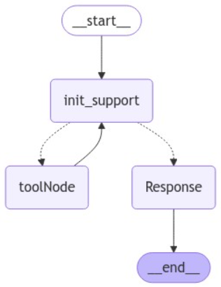

## ReAct agent Smart Restaurant Assistant (v3.0)

## This release introduces advanced capabilities using LangGraph for managing workflows and integrates a React Agent with custom tools for improved response accuracy. 

## Key Features and Updates

>React Agent with Multi-Tool Support:
- Utilized a React Agent for reasoning-driven interactions.
- Added two tools:
* Custom Retrieval Tool: Provides precise and optimized retrieval of data using Faiss for similarity search.
* Custom Tool:  Specifically designed to generate a structured order output, handling operations like dynamic updates to orders, cancellations

>Improved Accuracy and Responsiveness:
- Achieved significantly better response accuracy compared to the previous version.
- Faster responses for basic questions by avoiding unnecessary tool usage.

>Enhanced Query Handling:
- Tools dynamically engage only when needed for complex operations, ensuring efficient use of resources.

>Disadvantages
- Latency for Complex Queries:
* While accurate, responses for complex queries involving tools experience increased latency (~800ms).
* Tool invocations introduce overhead when interacting

>How to Install and Use:
- Clone the Repository
- Install Dependencies - npm install
- Configure the Environment - Add the necessary API keys and configurations (e.g., OpenAI API key) to the .env.local file
- Start the Application - npm run dev
- Navigate to the desired workflow or testing page by typing /pages in the URL
